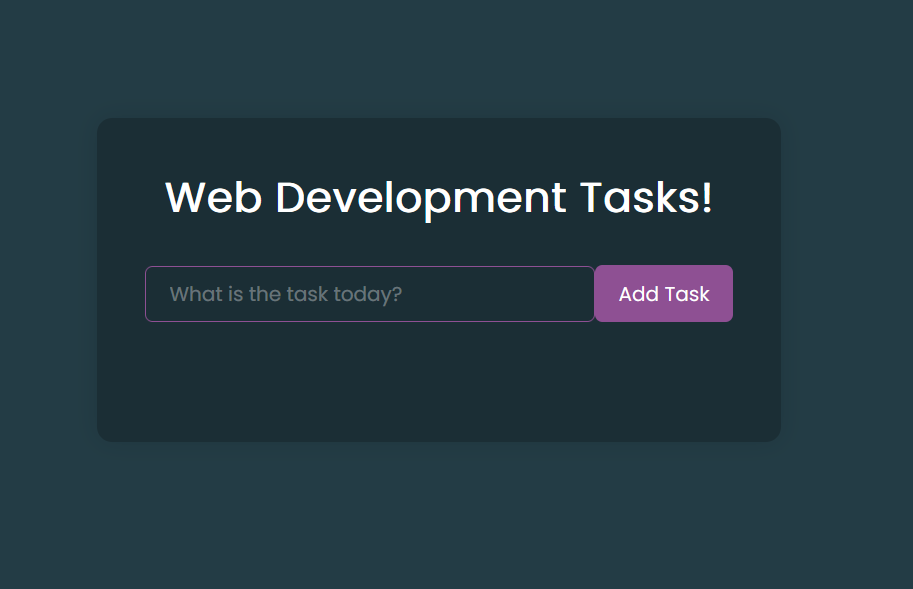

# 📝 MERN Todo-ist Web App


Welcome to the MERN Todo List Web App! This project is a simple yet powerful todo list application built using the MERN (MongoDB, Express.js, React, Node.js) stack. It allows users to add, update, edit, and delete tasks seamlessly.

## 🚀 Features

- **Add Tasks**: Easily add new tasks to your todo list.
- **Update Tasks**: Update task details with a click.
- **Edit Tasks**: Edit your existing tasks as needed.
- **Delete Tasks**: Remove tasks that are no longer needed.
- **Responsive Design**: Works beautifully on all devices.

## 📸 Screenshots



## 🛠️ Technologies Used

- **Frontend**:
  - 
- **Backend**:
  - 
  - 
- **Database**:
  - 
- **Version Control**:
  - 
  - 

## 🏗️ Getting Started

To get a local copy up and running, follow these simple steps:

### Prerequisites

- [Node.js](https://nodejs.org/)
- [MongoDB](https://www.mongodb.com/)

### Installation

1. Clone the repo
   ```sh
   git clone https://github.com/priyadeepsen/TheTodo-ist.git

2)Install NPM packages
  
  npm install

3)Start Development Server

  npm run dev

📧 Contact

Priyadeep Sen

Email: priyadeepsen990@gmail.com

ProjectLink: https://github.com/priyadeepsen/TheTodo-ist
   
